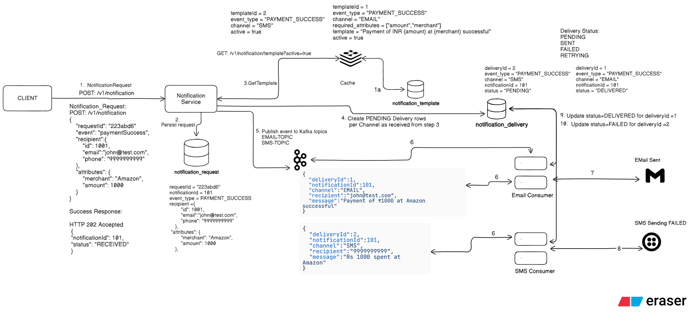

# NotifyHub

## Overview

NotifyHub is an event-driven notification platform built using Java, Spring Boot, Kafka, MySQL, Docker, and Kubernetes concepts.

The platform allows client applications to send notifications through multiple channels such as Email and SMS using a centralized, template-driven architecture.

Notifications are processed asynchronously using Kafka to improve scalability, reliability, and system decoupling.

---

## Problem Statement

Many applications implement notification logic independently, resulting in:

* Duplicate development effort
* Tight coupling with notification providers
* Inconsistent notification formats
* Limited scalability
* Difficult maintenance

NotifyHub solves this by providing a reusable notification platform that can be integrated with any application.

---

## Features

### Phase 1

* REST API for notification submission
* Email notifications
* SMS notifications
* Template-driven message generation
* Kafka-based asynchronous processing
* Notification delivery tracking
* Idempotent request handling
* MySQL persistence

### Future Enhancements

* Retry mechanism
* Dead Letter Queue (DLQ)
* Redis caching
* Push notifications
* WhatsApp notifications
* Kubernetes deployment
* Prometheus and Grafana monitoring

---

## Architecture



---

## Technology Stack

* Java 17
* Spring Boot
* Apache Kafka (KRaft Mode)
* MySQL
* Maven
* Docker
* Git & GitHub

Future:

* Kubernetes
* Prometheus
* Grafana

---

## API

### Create Notification

```http
POST /v1/notifications
```

Request:

```json
{
  "requestId": "PAYMENT-123456",
  "eventType": "PAYMENT_SUCCESS",
  "recipient": {
    "email": "john@test.com",
    "phone": "9999999999"
  },
  "attributes": {
    "amount": "1000",
    "merchant": "Amazon"
  }
}
```

Response:

```json
{
  "notificationId": 101,
  "status":"RECEIVED"
}
```

---

### Get Notification Status

```http
GET /v1/notifications/{notificationId}
```

Example Response:

```json
{
  "notificationId": 101,
  "overallStatus": "PARTIALLY_COMPLETED",
  "deliveries": [
    {
      "channel": "EMAIL",
      "status": "DELIVERED"
    },
    {
      "channel": "SMS",
      "status": "FAILED"
    }
  ]
}
```

---

## Project Structure

```text
notifyHub
│
├── docs
│   ├── SRS.md
│   ├── HLD.md
│   └── images
│
├── notification-service
│
└── README.md
```

---

## Design Documents

* Software Requirements Specification (SRS)
* High Level Design (HLD)
* Low Level Design (LLD)

---

## Learning Objectives

This project demonstrates hands-on experience with:

* Spring Boot REST APIs
* Kafka Producers and Consumers
* Event-Driven Architecture
* Database Design
* Idempotency
* Template-Based Notifications
* Docker
* Kubernetes Concepts
* Enterprise System Design

---

## Author

Akshita Srivastava

13+ years of experience in Telecom OSS/BSS, Order Management Systems, Cloud Platform Engineering, AWS, Microservices, Event-Driven Architectures, and Enterprise Workflow Platforms.
