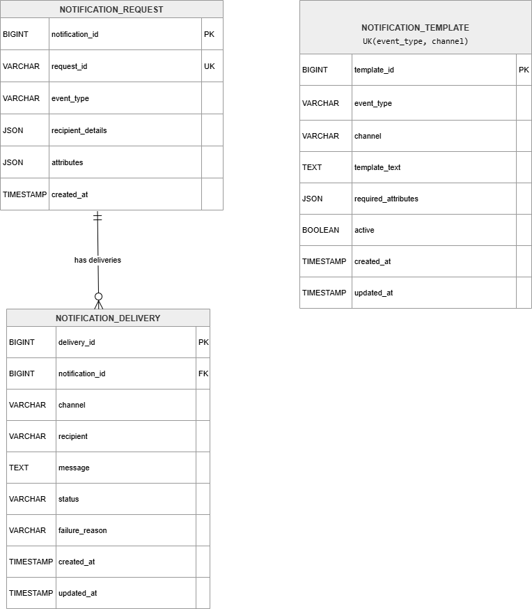
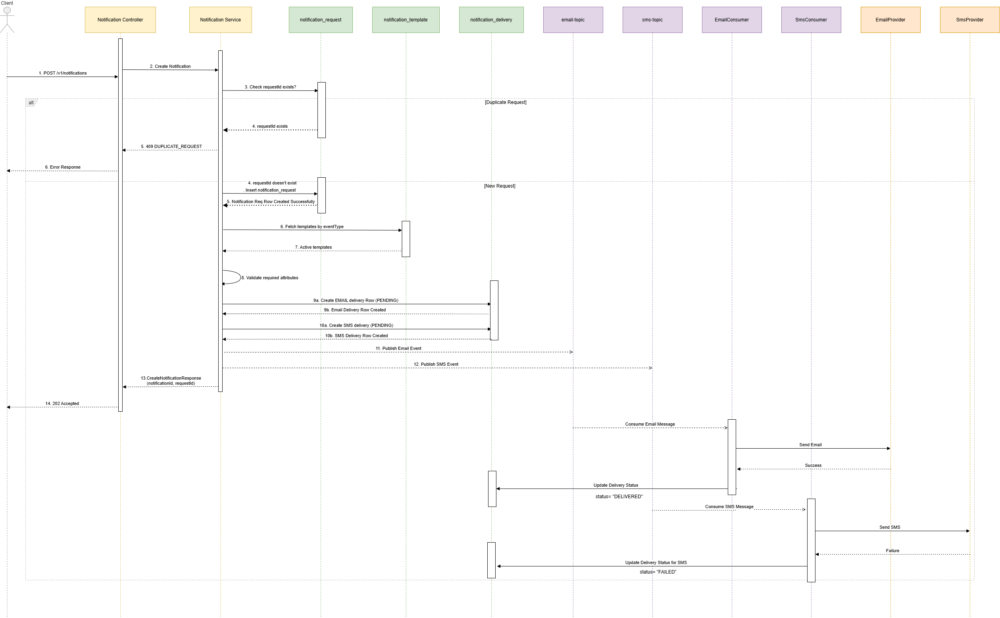

# NotifyHub - Low Level Design (LLD)

# 1. Overview

NotifyHub is an event-driven notification platform designed to provide a centralized mechanism for sending notifications through multiple channels such as Email and SMS.

The platform uses Spring Boot, Apache Kafka, and MySQL to provide asynchronous notification processing, template-driven message generation, delivery tracking, and idempotent request handling.

---

# 2. Database Design

## 2.1 notification_request

### Purpose

Stores accepted notification requests and provides idempotency using request_id.

### Schema

```sql
notification_request

notification_id      BIGINT AUTO_INCREMENT PRIMARY KEY

request_id           VARCHAR(36) NOT NULL UNIQUE

event_type           VARCHAR(100) NOT NULL

recipient_details    JSON NOT NULL

attributes           JSON NOT NULL

created_at           TIMESTAMP NOT NULL DEFAULT CURRENT_TIMESTAMP
```

### Sample Record

```json
{
  "notificationId": 101,
  "requestId": "550e8400-e29b-41d4-a716-446655440000",
  "eventType": "PAYMENT_SUCCESS",
  "recipientDetails": {
    "email": "john@test.com",
    "phone": "9999999999"
  },
  "attributes": {
    "amount": "1000",
    "merchant": "Amazon"
  }
}
```

---

## 2.2 notification_template

### Purpose

Stores channel-specific notification templates.

### Schema

```sql
notification_template

template_id           BIGINT AUTO_INCREMENT PRIMARY KEY

event_type            VARCHAR(100) NOT NULL

channel               VARCHAR(20) NOT NULL

template_text         TEXT NOT NULL

required_attributes   JSON NOT NULL

active                BOOLEAN NOT NULL DEFAULT TRUE

created_at            TIMESTAMP NOT NULL DEFAULT CURRENT_TIMESTAMP

updated_at            TIMESTAMP NOT NULL DEFAULT CURRENT_TIMESTAMP

UNIQUE(event_type, channel)
```

### Sample Records

#### EMAIL

```text
templateId = 1
eventType = PAYMENT_SUCCESS
channel = EMAIL
requiredAttributes = ["amount","merchant"]
templateText = Payment of ₹{amount} at {merchant} successful
active = true
```

#### SMS

```text
templateId = 2
eventType = PAYMENT_SUCCESS
channel = SMS
requiredAttributes = ["amount","merchant"]
templateText = Rs {amount} spent at {merchant}
active = true
```

---

## 2.3 notification_delivery

### Purpose

Tracks delivery attempts and acts as the source of truth for notification status.

### Schema

```sql
notification_delivery

delivery_id          BIGINT AUTO_INCREMENT PRIMARY KEY

notification_id      BIGINT NOT NULL

channel              VARCHAR(20) NOT NULL

recipient            VARCHAR(255) NOT NULL

message              TEXT NOT NULL

status               VARCHAR(20) NOT NULL

failure_reason       VARCHAR(500)

created_at           TIMESTAMP NOT NULL DEFAULT CURRENT_TIMESTAMP

updated_at           TIMESTAMP NOT NULL DEFAULT CURRENT_TIMESTAMP

FOREIGN KEY(notification_id)
REFERENCES notification_request(notification_id)
```

### Sample Records

```text
deliveryId = 1
notificationId = 101
channel = EMAIL
recipient = john@test.com
message = Payment of ₹1000 at Amazon successful
status = DELIVERED
```

```text
deliveryId = 2
notificationId = 101
channel = SMS
recipient = 9999999999
message = Rs 1000 spent at Amazon
status = FAILED
failureReason = Invalid Phone Number
```

---

# 3. Entity Relationship Design

## 3.1 ER Diagram




---

## 3.2 Relationship Description

### notification_request → notification_delivery

A notification request has a one-to-many relationship with notification_delivery.

A single notification request may result in multiple delivery records depending on the active notification channels configured for the event type.

Example:

```text
Notification Request
        |
        +---- Email Delivery
        |
        +---- SMS Delivery
```

For a PAYMENT_SUCCESS event, if both Email and SMS templates are active, two delivery records will be created.

Example:

```text
notificationId = 101

deliveryId = 1 (EMAIL)

deliveryId = 2 (SMS)
```

---

## 3.3 Design Decisions

### Template Independence

notification_template is intentionally not linked to notification_request through a foreign key relationship.

Templates are retrieved dynamically using:

* event_type
* channel

This allows notification templates to be modified independently without impacting historical notification records.

---

### Idempotency

request_id is maintained as a unique key in notification_request.

This prevents duplicate notification requests from being processed multiple times.

If a request with an existing request_id is received, NotifyHub treats it as a duplicate request and avoids creating duplicate notifications.

---

### Delivery Tracking

notification_delivery acts as the source of truth for notification status.

Each channel-specific delivery attempt is stored as an individual record.

Examples:

```text
EMAIL -> DELIVERED

SMS -> FAILED
```

The overall notification status can be derived from associated delivery records instead of storing a separate status in notification_request.

---

### Delivery Status Values

The following delivery statuses are supported in Phase 1:

```text
PENDING
DELIVERED
FAILED
```

---

### Template Uniqueness

The notification_template table enforces the following unique constraint:

```text
UNIQUE(event_type, channel)
```

This ensures only one template exists for a given event type and channel combination.

---

### Failure Reason Tracking

notification_delivery contains an optional failure_reason column.

Examples:

```text
Invalid Phone Number

SMTP Connection Timeout

Email Provider Unavailable
```

This information can be used for troubleshooting and operational visibility.

---

### JSON-Based Recipient Storage

Recipient information is stored in JSON format.

Example:

```json
{
  "email": "john@test.com",
  "phone": "9999999999"
}
```

This allows future recipient types to be introduced without database schema changes.

---

### JSON-Based Event Attributes

Notification-specific attributes are stored as JSON.

Example:

```json
{
  "amount": "1000",
  "merchant": "Amazon"
}
```

This enables support for multiple event types without requiring schema modifications.

---

# 4. Database Indexes

## notification_request

```sql
PRIMARY KEY(notification_id)

UNIQUE INDEX uk_request_id(request_id)

INDEX idx_event_type(event_type)
```

## notification_template

```sql
PRIMARY KEY(template_id)

UNIQUE INDEX uk_event_channel(event_type, channel)

INDEX idx_active(active)
```

## notification_delivery

```sql
PRIMARY KEY(delivery_id)

INDEX idx_delivery_notification_id(notification_id)

INDEX idx_status(status)
```

---

# 5. Kafka Design

## Topics

```text
email-topic

sms-topic
```

---

## Email Topic Payload

```json
{
  "notificationId": 101,
  "deliveryId": 1,
  "channel": "EMAIL",
  "recipient": "john@test.com",
  "message": "Payment of ₹1000 at Amazon successful"
}
```

---

## SMS Topic Payload

```json
{
  "notificationId": 101,
  "deliveryId": 2,
  "channel": "SMS",
  "recipient": "9999999999",
  "message": "Rs 1000 spent at Amazon"
}
```

---

# 6. Processing Flow

1. Client submits notification request.
2. Notification Service validates request.
3. Notification Service persists request in notification_request.
4. Notification Service retrieves active templates from notification_template.
5. Notification Service creates PENDING records in notification_delivery.
6. Notification Service publishes messages to Kafka topics.
7. Email Consumer processes email messages.
8. SMS Consumer processes SMS messages.
9. Consumers update notification_delivery status.
10. Notification status can be retrieved using delivery records.

---
# 7. API Contract Design

## 7.1 Create Notification API

### Endpoint

```http
POST /v1/notifications
```

### Purpose

Accepts a notification request from a client application and initiates asynchronous notification processing.

### Request Body

```json
{
  "requestId": "550e8400-e29b-41d4-a716-446655440000",
  "eventType": "PAYMENT_SUCCESS",
  "recipient": {
    "email": "john@test.com",
    "phone": "9999999999"
  },
  "attributes": {
    "amount": "1000",
    "merchant": "Amazon"
  }
}
```

### Success Response

HTTP 202 Accepted

```json
{
  "notificationId": 101,
  "requestId": "550e8400-e29b-41d4-a716-446655440000"
  
}
```

### Validation Rules

| Field              | Validation                                             |
| ------------------ | ------------------------------------------------------ |
| requestId          | Mandatory, UUID format, Must be unique                 |
| eventType          | Mandatory, Supported event type                        |
| recipient          | Mandatory                                              |
| attributes         | Mandatory, Based on event type                         |


## Supported Event Types

| Event Type      | Required Attributes   | Supported Channels |
| --------------- | --------------------- | ------------------ |
| PAYMENT_SUCCESS | amount, merchant      | EMAIL, SMS         |
| ORDER_DELIVERED | orderId, deliveryDate | EMAIL, SMS         |
| PASSWORD_RESET  | resetLink             | EMAIL              |

### Example: PAYMENT_SUCCESS

```json
{
  "requestId": "550e8400-e29b-41d4-a716-446655440000",
  "eventType": "PAYMENT_SUCCESS",
  "recipient": {
    "email": "john@test.com",
    "phone": "9999999999"
  },
  "attributes": {
    "amount": "1000",
    "merchant": "Amazon"
  }
}
```

### Validation Rules

1. eventType must exist in notification_template.
2. All required attributes configured for the event type must be present in the request.
3. Missing required attributes result in HTTP 400 Bad Request.
4. Only active templates are considered for notification processing.

---

### Error Responses

#### Duplicate Request

HTTP 409 Conflict

```json
{
  "errorCode": "DUPLICATE_REQUEST",
  "message": "Request already exists"
}
```

#### Invalid Request

HTTP 400 Bad Request

```json
{
  "errorCode": "MISSING_REQUIRED_ATTRIBUTE",
  "message": "merchant attribute is mandatory"
}
```

---

## 7.2 Get Notification Status API

### Endpoint

```http
GET /v1/notifications/request/{requestId}
```

### Purpose

Returns delivery status information for a notification request.

### Path Parameters

| Parameter | Description                                      |
| --------- | ------------------------------------------------ |
| requestId | Unique request identifier supplied by the client |

### Success Response

HTTP 200 OK

```json
{
  "requestId": "550e8400-e29b-41d4-a716-446655440000",
  "overallStatus": "PARTIALLY_COMPLETED",
  "deliveries": [
    {
      "channel": "EMAIL",
      "status": "DELIVERED"
    },
    {
      "channel": "SMS",
      "status": "FAILED"
    }
  ]
}
```

### Overall Status Calculation

| Delivery Statuses              | Overall Status      |
| ------------------------------ | ------------------- |
| All DELIVERED                  | COMPLETED           |
| Some DELIVERED and Some FAILED | PARTIALLY_COMPLETED |
| All FAILED                     | FAILED              |
| At least one PENDING           | IN_PROGRESS         |

### Error Response

HTTP 404 Not Found

```json
{
  "errorCode": "NOTIFICATION_NOT_FOUND",
  "message": "Notification request not found"
}
```
# 8. Sequence Diagram

## Notification Processing Sequence Diagram



## Sequence Description

1. Client submits notification request.
2. Controller validates request payload.
3. Notification Service checks for duplicate requestId.
4. Notification request is persisted in notification_request.
5. Active templates are retrieved using eventType.
6. Required attributes are validated against template configuration.
7. PENDING delivery records are created for all applicable channels.
8. Channel-specific messages are published to Kafka topics.
9. Consumers process messages and invoke notification providers.
10. Providers return success or failure response.
11. Consumers update notification_delivery status accordingly.

# 9. DTO Design

## 9.1 Create Notification Request DTO

### CreateNotificationRequest

```java
public class CreateNotificationRequest {

    @NotBlank
    private String requestId;

    @NotBlank
    private String eventType;

    @NotNull
    private RecipientDto recipient;

    @NotNull
    private Map<String, String> attributes;
}
```

### RecipientDto

```java
public class RecipientDto {

    private String email;

    private String phone;
}
```

---

## 9.2 Create Notification Response DTO

### CreateNotificationResponse

```java
public class CreateNotificationResponse {

    private Long notificationId;

    private String requestId;
}
```

### Example Response

```json
{
  "notificationId": 101,
  "requestId": "550e8400-e29b-41d4-a716-446655440000"
}
```

---

## 9.3 Delivery Status DTO

### DeliveryStatusDto

```java
public record DeliveryStatusDto(
        String channel,
        String status
) {}
```

---

## 9.4 Notification Status Response DTO

```java
public class NotificationStatusResponse {

    private String requestId;

    private String overallStatus;

    private List<DeliveryStatusDto> deliveries;
}
```

### Example Response

```json
{
  "requestId": "550e8400-e29b-41d4-a716-446655440000",
  "overallStatus": "PARTIALLY_COMPLETED",
  "deliveries": [
    {
      "channel": "EMAIL",
      "status": "DELIVERED"
    },
    {
      "channel": "SMS",
      "status": "FAILED"
    }
  ]
}
```

---

## 9.5 Kafka Event DTO

```java
public class NotificationEvent {

    private Long notificationId;

    private Long deliveryId;

    private String channel;

    private String recipient;

    private String message;
}
```

### Example Event

```json
{
  "notificationId": 101,
  "deliveryId": 1,
  "channel": "EMAIL",
  "recipient": "john@test.com",
  "message": "Payment of ₹1000 at Amazon successful"
}
```

---
# 10. Entity Design

The application uses JPA entities to map relational database tables to Java domain objects.

---

## 10.1 NotificationRequest Entity

### Purpose

Represents a notification request submitted by a client application.

### Table Mapping

```java
@Entity
@Table(
    name = "notification_request",
    uniqueConstraints = {
        @UniqueConstraint(columnNames = "request_id")
    }
)
```

### Fields

| Field | Type | Description |
|---------|---------|---------|
| notificationId | Long | Auto-generated primary key |
| requestId | String | Client supplied unique identifier |
| eventType | String | Notification event type |
| recipientDetails | String/JsonNode | Recipient information |
| attributes | String/JsonNode | Event attributes |
| createdAt | LocalDateTime | Request creation timestamp |

---

## 10.2 NotificationTemplate Entity

### Purpose

Stores notification templates for different event types and channels.

### Table Mapping

```java
@Entity
@Table(
    name = "notification_template",
    uniqueConstraints = {
        @UniqueConstraint(columnNames = {"event_type","channel"})
    }
)
```

### Fields

| Field | Type | Description |
|---------|---------|---------|
| templateId | Long | Auto-generated primary key |
| eventType | String | Event type |
| channel | ChannelType | Delivery channel |
| templateText | String | Message template |
| requiredAttributes | String/JsonNode | Required attributes list |
| active | Boolean | Template active flag |
| createdAt | LocalDateTime | Creation timestamp |
| updatedAt | LocalDateTime | Last modification timestamp |

---

## 10.3 NotificationDelivery Entity

### Purpose

Tracks notification delivery status for each channel.

### Table Mapping

```java
@Entity
@Table(name = "notification_delivery")
```

### Fields

| Field | Type | Description |
|---------|---------|---------|
| deliveryId | Long | Auto-generated primary key |
| notificationId | Long | Foreign key reference |
| channel | ChannelType | Delivery channel |
| recipient | String | Recipient address |
| message | String | Generated notification message |
| status | DeliveryStatus | Delivery status |
| failureReason | String | Failure details |
| createdAt | LocalDateTime | Creation timestamp |
| updatedAt | LocalDateTime | Last update timestamp |

---

## 10.4 Entity Relationships

### NotificationRequest → NotificationDelivery

Relationship Type:

```text
One-To-Many
```

JPA Mapping:

```java
@OneToMany(
    mappedBy = "notificationRequest",
    cascade = CascadeType.ALL
)
private List<NotificationDelivery> deliveries;
```

---

### NotificationDelivery → NotificationRequest

Relationship Type:

```text
Many-To-One
```

JPA Mapping:

```java
@ManyToOne(fetch = FetchType.LAZY)
@JoinColumn(name = "notification_id")
private NotificationRequest notificationRequest;
```

---

## 10.5 Enumerations

### ChannelType

```java
public enum ChannelType {

    EMAIL,
    SMS
}
```

---

### DeliveryStatus

```java
public enum DeliveryStatus {

    PENDING,
    DELIVERED,
    FAILED
}
```

---

### OverallStatus

```java
public enum OverallStatus {

    IN_PROGRESS,
    COMPLETED,
    PARTIALLY_COMPLETED,
    FAILED
}
```

# 11. Exception Handling Strategy

## 11.1 Objective

NotifyHub uses centralized exception handling to provide consistent error responses across all APIs.

Spring Boot's `@RestControllerAdvice` mechanism is used to convert application exceptions into standardized HTTP responses.

---

## 11.2 Error Response Structure

```java
public class ErrorResponse {

    private String errorCode;

    private String message;

    private LocalDateTime timestamp;
}
```

### Example

```json
{
  "errorCode": "DUPLICATE_REQUEST",
  "message": "Request already exists",
  "timestamp": "2026-06-16T12:30:15"
}
```

---

## 11.3 Custom Exceptions

### DuplicateRequestException

Thrown when a notification request is submitted with an existing requestId.

```java
public class DuplicateRequestException extends RuntimeException {
}
```

HTTP Response:

```text
409 CONFLICT
```

---

### ValidationException

Thrown when mandatory request fields or attributes are missing.

```java
public class ValidationException extends RuntimeException {
}
```

HTTP Response:

```text
400 BAD REQUEST
```

---

### ResourceNotFoundException

Thrown when a notification request cannot be found.

```java
public class ResourceNotFoundException extends RuntimeException {
}
```

HTTP Response:

```text
404 NOT FOUND
```

---

## 11.4 Global Exception Handler

```java
@RestControllerAdvice
public class GlobalExceptionHandler {
}
```

### Responsibilities

- Convert exceptions into standard API responses.
- Return appropriate HTTP status codes.
- Prevent stack traces from being exposed to clients.
- Maintain consistent error contracts.

---

## 11.5 Error Codes

| Error Code | HTTP Status | Description |
|------------|------------|-------------|
| DUPLICATE_REQUEST | 409 | Request ID already exists |
| VALIDATION_ERROR | 400 | Invalid request payload |
| REQUEST_NOT_FOUND | 404 | Notification request not found |
| INTERNAL_SERVER_ERROR | 500 | Unexpected system error |

---

# 12. Configuration Design

## 12.1 Application Configuration

```yaml
spring:
  datasource:
    url: jdbc:mysql://localhost:3306/notifyhub
    username: root
    password: root

  jpa:
    hibernate:
      ddl-auto: validate

  kafka:
    bootstrap-servers: localhost:9092

notifyhub:
  kafka:
    topics:
      email: email-topic
      sms: sms-topic
```

---

## 12.2 Kafka Topic Configuration

```java
@ConfigurationProperties(prefix = "notifyhub.kafka.topics")
public class KafkaTopicProperties {

    private String email;

    private String sms;
}
```

### Purpose

- Externalize Kafka topic names.
- Avoid hardcoded topic values.
- Support environment-specific configuration.

---

## 12.3 Kafka Producer Configuration

```java
@Configuration
public class KafkaProducerConfig {
}
```

### Responsibilities

- Configure ProducerFactory.
- Configure KafkaTemplate.
- Serialize NotificationEvent objects.

---

## 12.4 Kafka Consumer Configuration

```java
@Configuration
public class KafkaConsumerConfig {
}
```

### Responsibilities

- Configure ConsumerFactory.
- Configure Kafka Listener Containers.
- Deserialize NotificationEvent objects.

---

## 12.5 ObjectMapper Configuration

```java
@Bean
public ObjectMapper objectMapper() {
    return new ObjectMapper();
}
```

### Purpose

- Serialize recipient_details JSON.
- Serialize attributes JSON.
- Serialize required_attributes JSON.

---


# 13. Future Enhancements

## Retry Mechanism

Introduce retry processing for temporary failures.

```text
FAILED
   ↓
Retry Topic
   ↓
Reprocess
```

---

## Dead Letter Queue (DLQ)

Introduce dedicated DLQ topics.

```text
email-topic-dlq

sms-topic-dlq
```

Messages that fail after retry exhaustion will be routed to DLQ.

---

## User Profile Service

Move recipient information outside notification requests.

```text
userId
   ↓
User Service
   ↓
Email / Phone Lookup
```

---

## Notification Preferences

Allow users to configure preferred channels.

Examples:

```text
EMAIL
SMS
PUSH
WHATSAPP
```

---

## Additional Notification Channels

Future support for:

```text
PUSH

WHATSAPP

IN_APP
```

---

## Notification History API

```http
GET /v1/notifications
```

Filters:

```text
eventType

status

dateRange
```

---

## Monitoring and Observability

Introduce:

```text
Prometheus

Grafana
```

for application monitoring and alerting.

---

## Kubernetes Deployment

Migrate from Docker Compose to Kubernetes.


# 14. Package Structure
```text
com.notifyhub
│
├── controller
├── service
├── repository
├── entity
├── dto
├── mapper
├── kafka
│   ├── producer
│   └── consumer
├── config
├── exception
├── util
└── enums
```
# 15. Repository Design

## NotificationRequestRepository

Responsibilities:

- Find by requestId
- Check duplicate request
- Save notification request

## NotificationTemplateRepository

Responsibilities:

- Find active templates by eventType

## NotificationDeliveryRepository

Responsibilities:

- Save delivery records
- Find deliveries by notificationId
- Find deliveries by status

# 16. Service Design

## NotificationService

Responsibilities:

- Validate request
- Check idempotency
- Persist notification request
- Create delivery records
- Publish Kafka events

## NotificationStatusService

Responsibilities:

- Retrieve notification status
- Derive overall status

## TemplateService

Responsibilities:

- Fetch active templates
- Validate required attributes

## MessageBuilderService

Responsibilities:

- Replace placeholders
- Generate notification content

# 17. Enum Design

## ChannelType

EMAIL
SMS

## DeliveryStatus

PENDING
DELIVERED
FAILED

## OverallStatus

IN_PROGRESS
COMPLETED
PARTIALLY_COMPLETED
FAILED

# 18. Phase 1 Scope

## Included

* Notification Submission API
* Email Notifications
* SMS Notifications
* Kafka-Based Processing
* Template-Driven Messages
* Delivery Tracking
* MySQL Persistence
* Idempotent Request Handling

## Excluded

* Retry Mechanism
* Dead Letter Queue (DLQ)
* Redis Cache
* Push Notifications
* WhatsApp Notifications
* Kubernetes Deployment
* Prometheus Monitoring
* Grafana Dashboards
* Multi-Tenant Client Management

```
```
